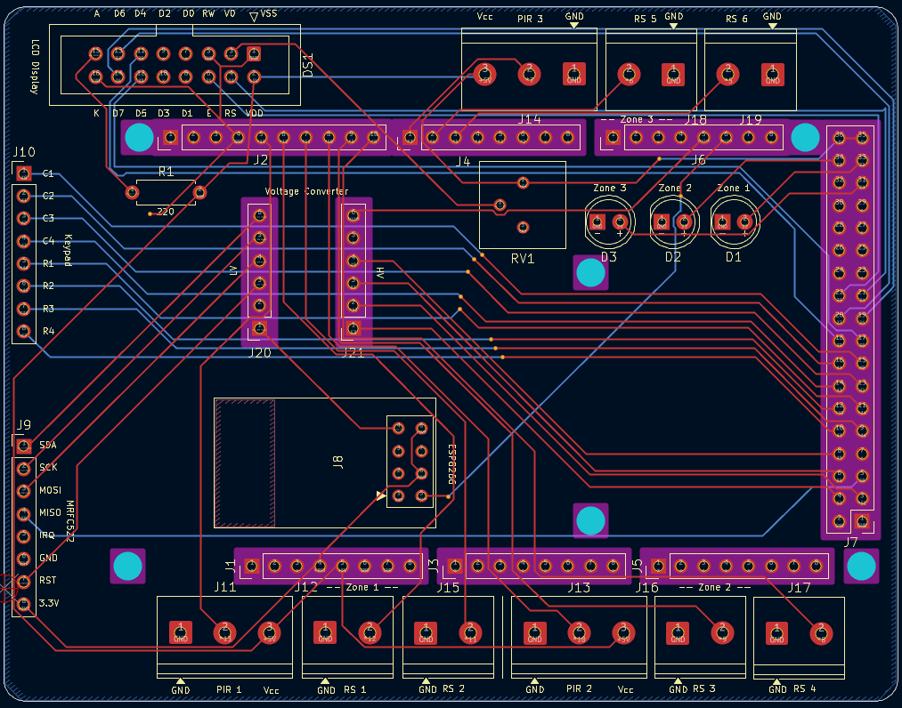
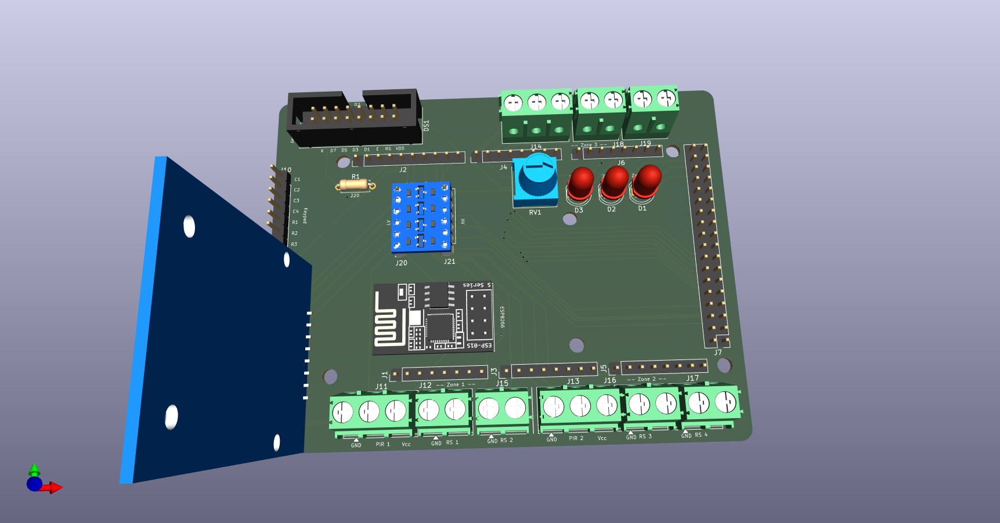
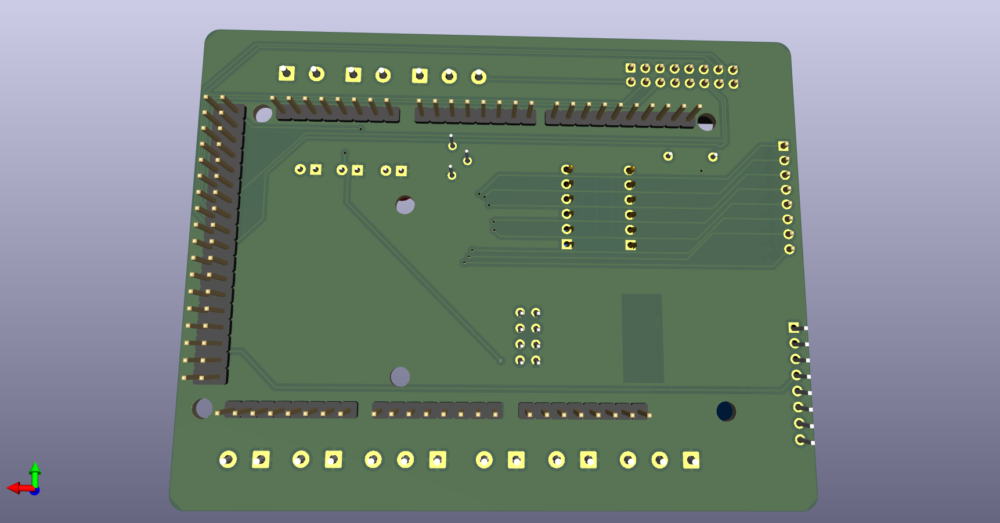

# Custom PCB Shield for Multi-Zone Security System


A custom two-layer **Arduino Mega** shield PCB designed to replace the breadboard prototype of the Multi-Zone Smart Security System. The board consolidates all control and sensing connections into a single, permanent, and reliable hardware platform.

> 🔗 **Firmware Repository:** [Multi-Zone Smart Security System](https://github.com/KhaledGhanem0/Smart-Security-System)

---

## Table of Contents

- [Overview](#overview)
- [Schematic](#schematic)
- [PCB Layout](#pcb-layout)
- [3D Render](#3d-render)
- [Design Specifications](#design-specifications)
- [Bill of Materials](#bill-of-materials)
- [File Structure](#file-structure)
- [License](#license)

---

## Overview

This project is a direct continuation of the [Multi-Zone Smart Security System](https://github.com/KhaledGhanem0/Smart-Security-System). The breadboard prototype, while functional, was not a reliable or permanent form factor. This shield was designed in **KiCad** to produce a clean, manufacturable PCB that sits directly on top of the Arduino Mega 2560 and exposes all the necessary connectors for the system's peripherals.

The design follows standard Arduino shield dimensions, ensuring mechanical compatibility with the Mega footprint. All components are through-hole (THT), making the board straightforward to solder by hand. The schematic was drawn as a single sheet with clear net labeling, and the PCB layout was routed with dedicated power and signal trace widths, a ground copper pour on the back copper layer, and a defined keep-out zone to avoid interference with the Arduino's onboard components.

---

## Schematic

The schematic captures the complete connectivity of all shield components in a single sheet. Each peripheral is connected to the appropriate Arduino Mega pins, with net labels used throughout to keep the diagram readable and avoid long crossing wires.


Key connections documented in the schematic:

- **RFID Reader (MFRC522)** — SPI bus (MOSI, MISO, SCK) with a dedicated chip-select pin
- **ESP8266 Wi-Fi Module** — Serial1 hardware UART (TX1 / RX1, pins 18–19)
- **LCD Screen** — 4-bit parallel interface
- **4×4 Keypad** — 8 digital I/O pins (4 rows, 4 columns)
- **PIR Sensors & Reed Switches** — Digital input pins, one per sensor across all three zones
- **Buzzers** — Digital output pins, one per zone
- **Power distribution** — 5 V and 3.3 V rails routed from the Arduino's onboard regulators to the appropriate peripherals

---

## PCB Layout

The PCB is sized to match Arduino Mega shield dimensions, with connectors positioned to align with the Mega's header rows. Components are placed on the front side only (all THT). A keep-out zone is defined over the Arduino's onboard USB and power jack area to prevent clearance violations.



Routing highlights:

- Signal traces routed at **0.25 mm** width
- Power traces routed at **0.5 mm** width
- **12 vias** used to transition signals between layers where needed
- **Ground copper pour** applied to the full B.Cu (back copper) layer, connected to the GND net
- All 5 V connections made through dedicated routed tracks on F.Cu

---

## 3D Render

The images below show the KiCad 3D render of the board before fabrication. All component footprints are placed on the front side of the board.

**Front**


**Back**


---

## Design Specifications

### Board Stackup

| Layer | Type | Thickness | Material |
|---|---|---|---|
| F.Silkscreen | Top Silk Screen | — | — |
| F.Paste | Top Solder Paste | — | — |
| F.Mask | Top Solder Mask | 0.01 mm | — |
| F.Cu | Copper | 0.035 mm | — |
| Dielectric 1 | Core | 1.51 mm | FR4 |
| B.Cu | Copper | 0.035 mm | — |
| B.Mask | Bottom Solder Mask | 0.01 mm | — |
| B.Paste | Bottom Solder Paste | — | — |
| B.Silkscreen | Bottom Silk Screen | — | — |

**Total board thickness:** 1.6 mm | **Solder mask color:** Green

### Board Dimensions

| Property | Value |
|---|---|
| Width | 100.584 mm |
| Height | 78.232 mm |
| Area | 7,863 mm² |

### Routing Rules

| Parameter | Value |
|---|---|
| Signal trace width | 0.25 mm |
| Power trace width | 0.50 mm |
| Minimum clearance | 0.2 mm |
| Copper to edge clearance | 0.075 mm |
| Minimum via diameter | 0.4 mm |
| Minimum drill (through hole) | 0.3 mm |
| Hole to hole clearance | 0.25 mm |

### Board Statistics

| Item | Count |
|---|---|
| THT components | 27 |
| Through-hole pads | 170 |
| NPTH (mounting holes) | 6 |
| Through vias | 12 |
| Total components | 33 |

---

## Bill of Materials

> The table below lists the components used on the shield.

| Reference | Value / Description | Footprint | Qty |
|---|---|---|---|
| DS1 | WC1602A (LCD Screen) | IDC Header 2×8, 2.54 mm | 1 |
| J1 | Power Header | Pin Header 1×8, 2.54 mm | 1 |
| J2 | PWM Header | Pin Header 1×10, 2.54 mm | 1 |
| J3, J5 | Analog Headers | Pin Header 1×8, 2.54 mm | 2 |
| J4 | PWM Header | Pin Header 1×8, 2.54 mm | 1 |
| J6 | Communication Header | Pin Header 1×8, 2.54 mm | 1 |
| J7 | Digital Header | Pin Header 2×18, 2.54 mm | 1 |
| J8 | ESP-01 (ESP8266 Wi-Fi Module) | ESP-01 Module Footprint | 1 |
| J9, J10 | Connectors 1×8 | Pin Header 1×8, 2.54 mm | 2 |
| J11, J13, J14 | Screw Terminal 3-pin (PIR Sensors) | Phoenix PT 1×3, 5.0 mm | 3 |
| J12, J15, J16, J17, J18, J19 | Screw Terminal 2-pin (Reed Switches) | Phoenix PT 1×2, 5.0 mm | 6 |
| J20, J21 | Socket Connectors 1×6 | Pin Socket 1×6, 2.54 mm | 2 |
| D1, D2, D3 | LED 5 mm (Zone Alarms) | LED THT, D5.0 mm | 3 |
| R1 | Resistor 220 Ω | Axial DIN0207, 7.62 mm pitch | 1 |
| RV1 | Potentiometer (LCD Contrast) | Bourns 3386P Vertical | 1 |

---

## File Structure

```
├── kicad/
│   ├── Security System Arduino Shield.kicad_pro   # KiCad project file
│   ├── Security System Arduino Shield.kicad_sch   # Schematic
│   ├── Security System Arduino Shield.kicad_pcb   # PCB layout
│   └── fp-lib-table                               # Footprint library references
├── images/
│   ├── schematic.pdf                              # Schematic PDF
│   ├── pcb_layout.png                             # PCB layout screenshot
│   ├── 3d_front.png                               # 3D render, front side
│   └── 3d_back.png                                # 3D render, back side
├── LICENSE
└── README.md
```

---

## License

This project is licensed under the [MIT License](LICENSE).
